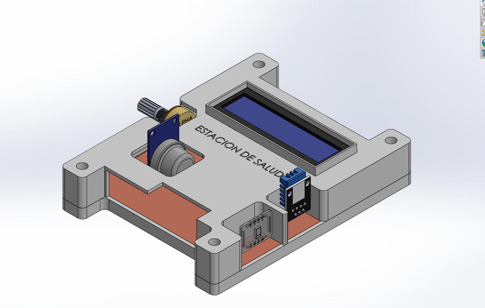
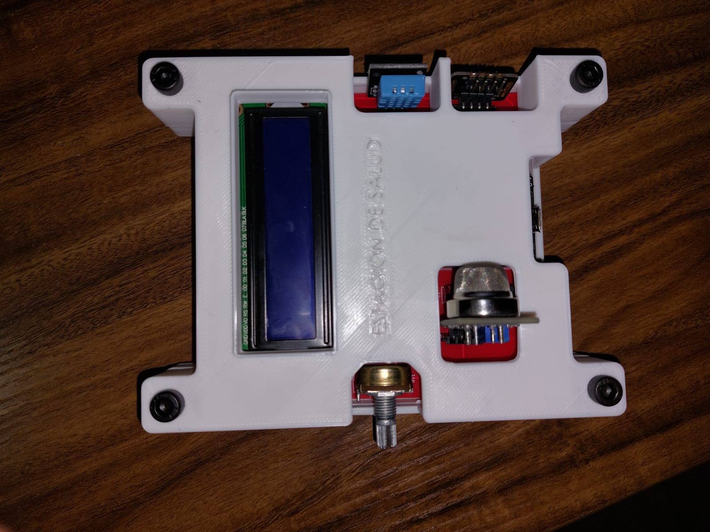

# IoT health station

This project consisted on creating an health monitoring embedded system using a ESP32 microcontroller.

Three sensors are supposed to be providing body and environment data to be streamed in real-time to a web dashboard using MQTT and a backend database linked to an Azure Server.

The data retrieved aboards the following:
- Temperature
- Humidity
- Heart rate
- Oxygen saturation
- Gas concentration

The 3D model, pcb, programming and comissioning was built from scratch.

The result is shown below:

